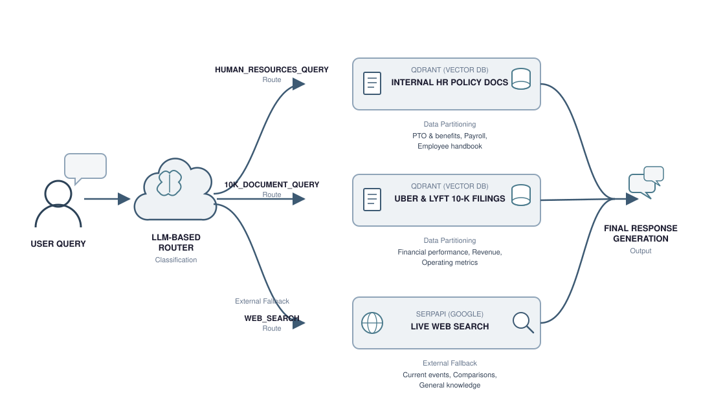

# 🧠 Enterprise-Grade RAG

**A production-style Retrieval-Augmented Generation system that doesn't just retrieve — it *decides where to look*.**

Most RAG demos bolt a single vector store onto an LLM and call it a day. This project goes further: an **LLM-based router** reads every incoming query, classifies its intent, and dispatches it to the *right* knowledge source — an internal HR policy index, a financial-filings index, or live web search — before a final response is synthesized. It's the difference between a toy chatbot and something you could actually put in front of enterprise users.

## 🏗️ Architecture



The flow is a **classify-then-retrieve** pipeline:

1. **User Query** hits an **LLM-based Router**, which classifies it into one of three routes.
2. **`HUMAN_RESOURCES_QUERY`** → routed to a **Qdrant** vector store indexing **internal HR policy documents** (PTO/leave policy, benefits, payroll, onboarding, the employee handbook).
3. **`10K_DOCUMENT_QUERY`** → routed to a second **Qdrant** index built from **Uber & Lyft 10-K annual filings** (financial performance, revenue, operating metrics).
4. **`WEB_SEARCH`** → falls back to **live web search** via **SerpAPI/Google** for current events, comparisons, or anything outside the indexed corpora.
5. Whatever comes back is fed into **final response generation**, producing one coherent answer regardless of which route fired underneath.

This is **semantic routing** applied to retrieval — each data domain gets its own optimized index instead of dumping everything into one giant, noisy vector store, and the system gracefully degrades to the open web when local knowledge runs out.

## ✨ Why this is more than a basic RAG pipeline

| Capability | What it buys you |
|---|---|
| 🧭 **LLM-driven intent classification** | No manual keyword rules — the router reasons about what the user actually wants |
| 🗂️ **Domain-partitioned vector stores** | Cleaner embeddings, less cross-domain noise, faster and more relevant retrieval |
| 🌐 **Live web fallback** | Never a dead end — queries outside the knowledge base still get answered |
| 🧩 **Composable retrieval** | Hybrid search building blocks (dense + BM25), multiple vector DB backends, and swappable embedding models |

## 🧰 Tech Stack

- **Orchestration:** LangChain (`langchain`, `langchain-anthropic`, `langchain-community`, `langchain-text-splitters`)
- **LLM:** Anthropic Claude via `anthropic` / `langchain-anthropic`
- **Vector Stores:** Qdrant (`qdrant-client`), Chroma (`chromadb`, `langchain-chroma`), FAISS (`faiss-cpu`)
- **Embeddings:** `langchain-huggingface`, `sentence-transformers`
- **Hybrid / Sparse Retrieval:** `rank_bm25`, `scikit-learn`
- **Web Search Fallback:** `duckduckgo-search`, `ddgs`, `requests`, `bs4`, `html2text`
- **Document Loaders:** `pypdf`, `docx2txt`, `wikipedia`
- **Data & Utilities:** `pandas`, `numpy`, `torch`, `datasets`, `kagglehub`, `tiktoken`, `einops`, `scipy`, `ipywidgets`, `matplotlib`

## 📁 Project Structure

```
.
├── notebooks/              # exploratory notebooks (routing experiments, etc.)
├── src/enterprise_rag/     # installable package (router, ingestion, retrieval code)
├── assets/                 # images used in docs
├── requirements.txt
└── pyproject.toml
```

## 🚀 Getting Started

### 1. Create a virtual environment

> ⚠️ Note: `numpy<2`, `torch`, `faiss-cpu`, and `chromadb` don't yet ship prebuilt wheels for the newest Python releases (e.g. 3.14). Use **Python 3.11** for a smooth install.

```bash
python3.11 -m venv .venv
source .venv/bin/activate
```

### 2. Install dependencies

```bash
pip install -r requirements.txt
pip install -e .
```

### 3. Configure your environment

Copy `.example.env` to `.env` and fill in your API keys:

```env
ANTHROPIC_API_KEY=your_key_here
OPENAI_API_KEY=your_key_here
QDRANT_URL=your_qdrant_url
QDRANT_API_KEY=your_qdrant_key
SERPAPI_API_KEY=your_serpapi_key
```

> No Qdrant account yet? Leave `QDRANT_URL` unset and the notebooks fall back to an in-process, in-memory Qdrant instance (`AsyncQdrantClient(location=":memory:")`) — no server or key required, just non-persistent between runs.

### 4. Run the router

Point the pipeline at your document sets (internal HR policy docs, 10-K filings, etc.), build the Qdrant indices, and start routing queries.

## 📌 Status

The project's dependency stack and architecture are defined — implementation of the router, ingestion pipelines, and indices is in progress. This README reflects the target design shown in the diagram above.
