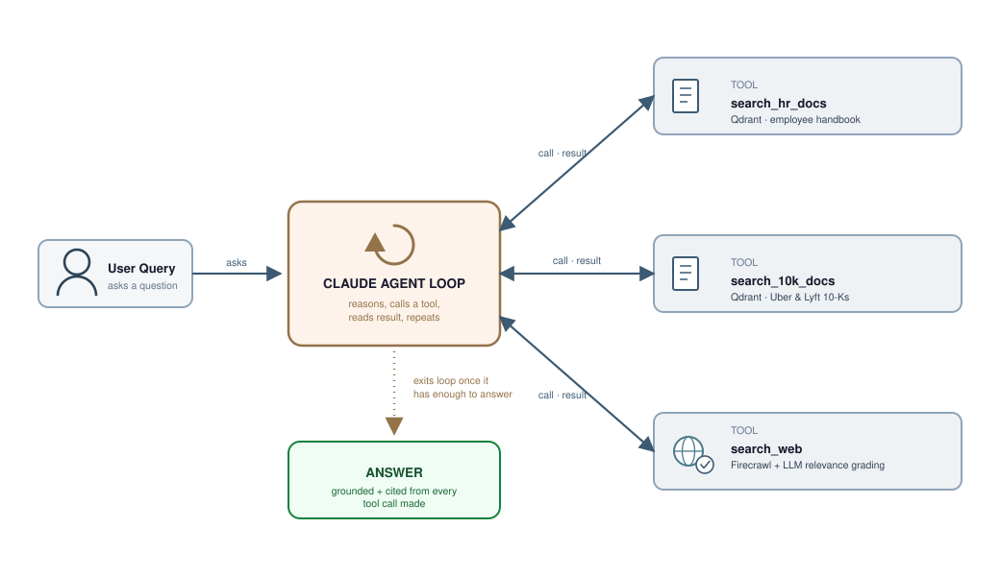

# 🧠 Enterprise-Grade RAG

**A production-style Retrieval-Augmented Generation system that doesn't just retrieve — it *decides where to look*.**

Most RAG demos bolt a single vector store onto an LLM and call it a day. This project goes further: Claude is given **tools**, not a fixed path — it reasons about each incoming query, decides which knowledge source(s) it actually needs (an internal HR policy index, a financial-filings index, live web search — zero, one, or several), calls them, reads the results, and repeats until it has enough to answer. It's the difference between a toy chatbot and something you could actually put in front of enterprise users.

## 🏗️ Architecture



The flow is an **agentic tool-use loop**, not a one-shot classifier:

1. **User Query** enters the agent loop along with three tool definitions. Two interchangeable loop implementations exist side by side: a raw Anthropic SDK loop (`run_agent_sdk`) and a LangChain tool-calling loop (`run_agent_langchain`) — both share the same tools and system prompt.
2. The agent reasons about what it needs and calls **`search_hr_docs`** (Qdrant: internal HR policy documents — PTO/leave policy, benefits, payroll, onboarding, the employee handbook), **`search_10k_docs`** (Qdrant: Uber & Lyft 10-K annual filings — financial performance, revenue, operating metrics), **`search_web`** (Firecrawl web search, with an LLM grading pass that filters out irrelevant/outdated results before they reach the agent) — or any combination of them; a compound question can trigger more than one tool in the same turn.
3. Each tool's result goes back to the agent, which reasons again: enough context to answer, or another call needed?
4. Once satisfied, the agent **exits the loop** and generates one coherent answer from everything it gathered.

This is **agentic retrieval** — instead of committing to a single path up front, the model controls its own retrieval strategy at runtime, which is what lets it actually handle compound questions spanning more than one knowledge source.

## ✨ Why this is more than a basic RAG pipeline

| Capability | What it buys you |
|---|---|
| 🧭 **Agentic tool selection** | No manual keyword rules or fixed branches — the agent reasons about which sources it actually needs, including more than one per query |
| 🗂️ **Domain-partitioned vector stores** | Cleaner embeddings, less cross-domain noise, faster and more relevant retrieval |
| 🌐 **Live web fallback with grading** | Never a dead end — queries outside the knowledge base still get answered, and an LLM grading pass filters irrelevant/stale web results before the agent sees them |
| 🔌 **Two interchangeable agent loops** | The same tool set runs behind a raw Anthropic SDK loop or a LangChain loop, exposed as separate FastAPI endpoints, so the orchestration layer is swappable |

## 🧰 Tech Stack

**Currently exercised by the code:**

- **LLM / agent loop:** Anthropic Claude (`anthropic` SDK, `langchain-anthropic`), LangChain tool-calling (`langchain`, `langchain-core`)
- **Vector store:** Qdrant (`qdrant-client`), one collection per domain (`hr_data`, `10k_data`), local in-memory fallback when `QDRANT_URL` is unset
- **Embeddings:** local `sentence-transformers/all-mpnet-base-v2` via `transformers` + `torch` (mean-pooled)
- **Web search:** Firecrawl API + LLM-based relevance grading, with a time-sensitivity heuristic that restricts recency-sensitive queries to the past month
- **API:** FastAPI + `uvicorn`
- **Testing:** `pytest`, `pytest-asyncio`, GitHub Actions CI on every push

**Installed for planned/future work (see Roadmap), not yet wired in:** `chromadb` / `langchain-chroma`, `faiss-cpu`, `rank_bm25` + `scikit-learn` (hybrid dense+BM25 retrieval), `docx2txt`, `wikipedia`, `kagglehub`.

## 📁 Project Structure

```
.
├── src/enterprise_rag/     # installable package
│   ├── agent.py            # both agent loops (Anthropic SDK + LangChain)
│   ├── api.py               # FastAPI app (/query, /query_langchain)
│   ├── tools.py             # search_web, search_hr_docs, search_10k_docs
│   ├── ingestion.py         # embed + upsert chunks into Qdrant
│   ├── pipeline.py          # ingestion_pipeline dispatcher over COLLECTIONS
│   ├── loaders.py           # load + token-aware chunk .txt files under data/
│   ├── retrieval.py         # collection-name registry
│   ├── llm_model.py         # shared ChatAnthropic instance
│   ├── prompt.py            # agent system prompt
│   └── utils.py             # embeddings + time-sensitivity heuristic
├── tests/                   # pytest suite for tools, agent loops, API, loaders
├── data/
│   ├── hr/                  # employee_handbook.txt
│   └── 10k/                 # uber_2023.txt, lyft_2023.txt
├── assets/                  # images used in docs
├── demo.py                  # scripted end-to-end run against the LangChain loop
├── requirements.txt
└── pyproject.toml
```

## 🚀 Getting Started

### 1. Create a virtual environment

> ⚠️ Note: `numpy<2`, `torch`, `faiss-cpu`, and `chromadb` don't yet ship prebuilt wheels for the newest Python releases (e.g. 3.14). Use **Python 3.11** for a smooth install.

```bash
python3.11 -m venv .venv
source .venv/bin/activate
```

### 2. Install dependencies

```bash
pip install -r requirements.txt
pip install -e .
```

### 3. Configure your environment

Copy `.example.env` to `.env` and fill in your API keys. The agent loop actually needs:

```env
ANTHROPIC_API_KEY=your_key_here
FIRECRAWL_API_KEY=your_firecrawl_key
QDRANT_URL=your_qdrant_url        # optional
QDRANT_API_KEY=your_qdrant_key    # optional
```

> No Qdrant account yet? Leave `QDRANT_URL` unset and the code falls back to an in-process, in-memory Qdrant instance (`AsyncQdrantClient(location=":memory:")`) — no server or key required, just non-persistent between runs.

### 4. Ingest documents and run the agent

```bash
python demo.py
```

`demo.py` loads every `.txt` file under `data/hr` and `data/10k`, splits each into token-aware chunks (`loaders.py`), upserts them into the `hr_data` and `10k_data` Qdrant collections via `ingest_documents`, then runs a few sample queries through `run_agent_langchain`. To serve the agent over HTTP instead:

```bash
uvicorn enterprise_rag.api:app --reload
```

```bash
curl -X POST localhost:8000/query \
  -H "Content-Type: application/json" \
  -d '{"question": "How many PTO days do I get?"}'
```

`/query` runs the raw Anthropic SDK loop; `/query_langchain` runs the LangChain loop against the same tools.

## 📌 Status

**Implemented**

- ✅ Both agent loops (Anthropic SDK + LangChain), sharing one tool set, tested end to end including max-turn exhaustion and API-error handling
- ✅ `search_web`, `search_hr_docs`, `search_10k_docs` tools, tested
- ✅ LLM-based relevance grading + time-sensitivity handling for `search_web`
- ✅ FastAPI endpoints (`/query`, `/query_langchain`), tested, returning 500 on agent failure
- ✅ Qdrant ingestion primitive (`ingest_documents`) and collection dispatcher (`ingestion_pipeline`)
- ✅ Loading and token-aware chunking of the real source documents under `data/` (HR handbook, Uber/Lyft 10-Ks) into the Qdrant indices (`loaders.py`), tested; `demo.py` ingests the actual files instead of hardcoded example chunks
- ✅ GitHub Actions CI running the test suite on every push

**Roadmap — not yet done**

- Test coverage for `ingestion.py` / `pipeline.py`
- Relevance grading + corrective retry (rewrite query / retry / fall back) for `search_hr_docs` and `search_10k_docs` — today that loop only exists for `search_web`
- Query rewriting — normalizing casual/compound user queries before retrieval; not yet implemented in `src/`
- Hybrid retrieval (dense + BM25 fusion) — dependencies are installed (`rank_bm25`, `scikit-learn`) but unused
- Persistent Qdrant deployment for production use (currently defaults to non-persistent in-memory when `QDRANT_URL` is unset)
- An evaluation suite (retrieval precision, answer groundedness) to measure the impact of the corrective loop once it exists
- A demoable UI (Streamlit/Gradio) on top of the FastAPI endpoints
